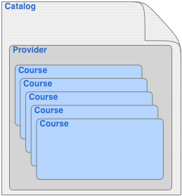

Image:Model.png 
===============

### From Xcri 

Jump to: [navigation](Image%253AModel.png#column-one),
[search](Image%253AModel.png#searchInput)

-   [Image](Image%253AModel.png#file)
-   [File history](Image%253AModel.png#filehistory)
-   [Links](Image%253AModel.png#filelinks)

[Model.png](../images/7/79/Model.png "Model.png")‎  (17KB, MIME type: `image/png`)

The XCRI basic transfer model.

File history 
------------

Legend: (cur) = this is the current file, (del) = delete this old
version, (rev) = revert to this old version.\
*Click on date to see the file uploaded on that date*.

-   (del) (cur) [12:49, 9 October
    2007](../images/7/79/Model.png "/wiki/images/7/79/Model.png") . .
    [Scottwilson](../index.php@title=User%253AScottwilson&action=edit.html "User:Scottwilson")
    ([Talk](../index.php@title=User_talk%253AScottwilson&action=edit.html "User talk:Scottwilson")
    |
    [contribs](Special%253AContributions/Scottwilson.html "Special:Contributions/Scottwilson")) .
    . 259×279 (16,772 bytes) (The XCRI basic
    transfer model.)

\
-   [Edit this file using an external
    application](../index.php@title=Image%253AModel.png&action=edit&externaledit=true&mode=file "Image:Model.png")
    

    See the [setup
    instructions](http://meta.wikimedia.org/wiki/Help:External_editors "http://meta.wikimedia.org/wiki/Help:External_editors") for more information.

    

Links 
-----

The following pages link to this file:

-   [XCRI CAP 1.1](XCRI_CAP_1.1.html "XCRI CAP 1.1")
-   [XCRI CAP 1.2
    Extras](XCRI_CAP_1.2_Extras.html "XCRI CAP 1.2 Extras")

Retrieved from
"[http://localhost/Image:Model.png](Image%253AModel.png)"

##### Views

-   

    

    [File](Image%253AModel.png)
-   

    

    [Discussion](../index.php@title=Image_talk%253AModel.png&action=edit.html)
-   

    

    [Edit](../index.php@title=Image%253AModel.png&action=edit.html)
-   

    

    [History](../index.php@title=Image%253AModel.png&action=history.html)

##### Personal tools

-   

    

    [127.0.0.1](User%253A127.0.0.1.html)
-   

    

    [Talk for this IP](User_talk%253A127.0.0.1.html)
-   

    

    [Log in / create
    account](../index.php@title=Special%253AUserlogin&returnto=Image%253AModel.png)

##### Navigation

-   

    

    [XCRI Wiki](../../wiki.1.html)
-   

    

    [XCRI website](http://www.xcri.org/)
-   

    

    [Current events](Current_events.html)
-   

    

    [Recent changes](Special%253ARecentchanges.html)
-   

    

    [Help](Help%253AContents.html)

##### Search

 

##### Toolbox

-   

    

    [What links
    here](Special%253AWhatlinkshere/Image%253AModel.png)
-   

    

    [Related
    changes](Special%253ARecentchangeslinked/Image%253AModel.png)
-   

    

    [Upload file](Special%253AUpload.html)
-   

    

    [Special pages](Special%253ASpecialpages.html)
-   

    

    [Printable
    version](../index.php@title=Image%253AModel.png&printable=yes.html)
-   

    

    [Permanent
    link](../index.php@title=Image%253AModel.png&oldid=644.html)

-   

    

    This page was last modified 12:49, 9 October 2007.
-   

    

    This page has been accessed 576 times.
-   

    

    Content is available under [Attribution
    3.0](http://creativecommons.org/licenses/by/3.0/ "http://creativecommons.org/licenses/by/3.0/").
-   

    

    [Privacy policy](Xcri%253APrivacy_policy.html "Xcri:Privacy policy")
-   

    

    [About Xcri](Xcri%253AAbout.html "Xcri:About")
-   

    

    [Disclaimers](Xcri%253AGeneral_disclaimer.html "Xcri:General disclaimer")

