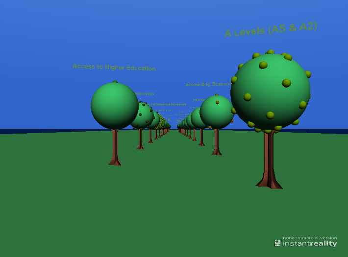

Sample XSLT code for transforming XCRI CAP 1.1 into X3D for data visualisation purposes 
=======================================================================================

This sample code takes an XCRI CAP 1.1 document with subject elements
attached to courses and renders them as a 3D visualisation; in this
case, a representation of an orchard with one tree per subject (ordered
alphabetically), each with a number of fruit which represents the
courses described by that subject. The output format is X3D, so you will
need a [viewer or browser plug-in](http://www.web3d.org/x3d/content/examples/X3dResources.html#Applications "http://www.web3d.org/x3d/content/examples/X3dResources.html#Applications") to see it. The purpose of this sample is to illustrate the kind
of opportunities that you have when you have course information in an
XML format.

The XSLT code 
-----------------------------------------------------------------------------------------------------------------------------------------------------------------------------------------------------------------------------------------------------------------
      
                                
	<?xml version="1.0" encoding="UTF-8"?>
	<xsl:stylesheet xmlns:xsl="http://www.w3.org/1999/XSL/Transform"
		xmlns:xsi="http://www.w3.org/2001/XMLSchema-instance"
		xmlns:xhtml="http://www.w3.org/1999/xhtml" xmlns:xcri="http://xcri.org/profiles/catalog"
		xmlns:xcriTerms="http://xcri.org/profiles/catalog/terms" version="1.0">
		<xsl:variable name="pi" select="3.14"/><!-- 1 radian = 180/π degrees. -->
		<xsl:variable name="phi" select="0.618034" /><!-- http://www.maths.surrey.ac.uk/hosted-sites/R.Knott/Fibonacci/fibnat2.html -->
		<xsl:template match="/xcri:catalog/xcri:provider[1]">
			<xsl:variable name="Subject" select="xcri:course/xcri:subject[position() = 1][not(. = preceding::xcri:subject)]" />
			<xsl:variable name="Course" select="xcri:course" />
			<X3D xmlns:xs="http://www.w3.org/2001/XMLSchema" xmlns:xsi="http://www.w3.org/2001/XMLSchema-instance"
				xmlns:dc="http://purl.org/dc/elements/1.1/" version="3.2" profile="Immersive"
				xsi:noNamespaceSchemaLocation="http://www.web3d.org/specifications/x3d-3.2.xsd">
				<Scene>
					<MetadataSet/>
					<NavigationInfo DEF="OrchardNavigationInfo" avatarSize="0.25 1.6 0.75" type='"WALK" "ANY"'
						speed="4" headlight="false"/>
					<Viewpoint DEF="InitialView" description="Initial view of orchard." orientation="0 0 1 0"
						position="0 5 5"/>
					<Background DEF="SkySea" groundAngle="1.57" groundColor="0 0 0.2, 0 0.1 0.3" skyAngle="1.4273"
						skyColor="0.5 0.8 1, 0.2 0.4 0.8"/>
					<!-- Here comes the sun. -->
					<DirectionalLight DEF="SunLight" ambientIntensity="0.35" color="1 1 0.9" direction="0 -0.5 -0.8" intensity="0.7"
						on="true"/>
					<ProtoDeclare name="SubjectTree">
						<ProtoInterface>
							<field name="labelText" accessType="initializeOnly" type="MFString"/>
						</ProtoInterface>
						<ProtoBody>
							<Group>
								<Transform translation="0 2.5 0">
									<Shape>
										<Sphere radius="1"/>
										<Appearance>
											<Material diffuseColor="0.3 1 0.6" shininess="0"/>
										</Appearance>
									</Shape>
								</Transform>
								<Shape>
									<Extrusion
									crossSection="0 0 -0.1, -0.07 0 -0.07, -0.1 0 0, -0.07 0 0.07, 0 0 0.1, 0.07 0 0.07, 0.1 0 0, 0.07 0          -0.07, 0 0 -0.1"
									spine="0 0 0, 0 0.2 0, 0 0.5 0, 0 1.4 0, 0 1.6 0" scale="3 3, 1.5 1.5, 1 1, 1 1, 2 2" creaseAngle="3.14"
									convex="true" ccw="true"/>
								<Appearance>
									<Material diffuseColor="0.8 0.4 0.3" shininess="0.1"/>
								</Appearance>
							</Shape>
							<Transform translation="0 4 0">
								<Billboard axisOfRotation="0 1 0">
									<Shape>
										<Text maxExtent="1.35">
											<IS>
												<connect nodeField="string" protoField="labelText"/>
											</IS>
											<FontStyle
												family='"SANS" "Verdana" "Helvetica" "Arial" "Geneva"'
												justify='"MIDDLE" "END"' size="0.3" style="BOLD"/>										</Text>
										<Appearance>
											<Material diffuseColor="0.5715 0.2115 0.125"/>
										</Appearance>
									</Shape>
								</Billboard>
							</Transform>
						</Group>
					</ProtoBody>
				</ProtoDeclare>
				<ProtoDeclare name="CourseFruit">
					<ProtoInterface>
						<field name="colour" accessType="inputOutput" type="SFColor" value="1 0.2 0" />
						<field name="size" accessType="inputOutput" type="SFFloat" value="0.1" />
					</ProtoInterface>
					<ProtoBody>
						<Shape>
							<Sphere>
								<IS>
									<connect nodeField="radius" protoField="size"/>
								</IS>
							</Sphere>
							<Appearance>
								<Material shininess="0.8">
									<IS>
										<connect nodeField="diffuseColor" protoField="colour"/>
									</IS>
								</Material>
							</Appearance>
						</Shape>
					</ProtoBody>
				</ProtoDeclare>
				<Transform translation="0 -0.1 {count($Subject) * -5}">
					<Shape>
						<Box size="96 0.1 {96 + count($Subject) * 10}"/>
						<Appearance>
							<Material diffuseColor="0.4 1 0.6"/>
						</Appearance>
					</Shape>
				</Transform>
				<xsl:for-each select="$Subject">
					<xsl:sort />
					<xsl:variable name="thisSubject" select="." />
					<xsl:variable name="SubjectCourse" select="$Course[xcri:subject = $thisSubject]" />
					<xsl:variable name="CourseCount" select="count($SubjectCourse)" />
					<!-- Colour seed method taken from X3D Christmas Tree via XSLT http://www.sleepingdog.org.uk/x3d/tree/ -->
					<!-- Create a varying colour for each subjects tree's course fruit, rounded down to three decimal fraction digits. -->
					<xsl:variable name="colourSeed" select="position() * 11"/>
					<xsl:variable name="red" select="round(($colourSeed div 7 - floor($colourSeed div 7)) * 1000) div 1000"/>
					<xsl:variable name="green" select="round(($colourSeed div 13 - floor($colourSeed div 13)) * 1000) div 1000"/>
					<xsl:variable name="blue" select="round(($colourSeed div 11 - floor($colourSeed div 11)) * 1000) div 1000"/>
					<xsl:variable name="variableColour" select="concat($red, ' ', $green, ' ', $blue)" />
					<Transform translation="{(position() mod 2 * 5) - 2.5} 0 {position() * -5}">
						<ProtoInstance name="SubjectTree">
							<fieldValue name="labelText" value="{.}"/>
						</ProtoInstance>
						<Transform translation="0 3.5 0">
							<xsl:for-each select="$SubjectCourse">
								<Transform rotation="0 1 0 {(position() - 1) * $phi * 2 * $pi}">
									<Transform rotation="0 0 1 {(position() - 1) * $pi div $CourseCount}" center="0 -1 0">
										<ProtoInstance name="CourseFruit">
											<fieldValue name="colour" value="{$variableColour}" />
											<fieldValue name="size" value="0.1" />
										</ProtoInstance>
									</Transform>
								</Transform>
							</xsl:for-each>
						</Transform>
					</Transform>
				</xsl:for-each>
			</Scene>
		</X3D>
	</xsl:template>
	<xsl:template match="/xcri:catalog/xcri:provider[position() > 1]" />
	</xsl:stylesheet>      

 Screenshot 
-----------------------------------------------------------------------------------------------------------------------------------------------------------------------------------------------------------------------------------------------------------

In this example, Northampton College's XCRI CAP 1.1 feed is transformed,
and this screenshot taken (using Instant Player).

