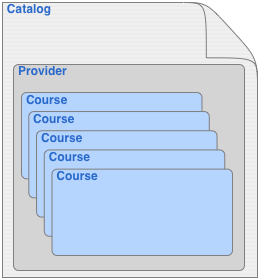

XCRI CAP 1.1 
============

### From Xcri 

(Redirected from [XCRI Course Advertising
Profile](../index.php@title=XCRI_Course_Advertising_Profile&redirect=no.html "XCRI Course Advertising Profile"))

Jump to: [navigation](XCRI_Course_Advertising_Profile.html#column-one),
[search](XCRI_Course_Advertising_Profile.html#searchInput)

This is the working area for the Course Advertising Profile v1.1
specification. This will be supserseded by [XCRI CAP
1.2](XCRI_CAP_1.2.html "XCRI CAP 1.2").

\

+--------------------------------------------------------------------------+
|                                                       |
|                                                                          |
| Contents                                                                 |
| --------                                                                 |
|                                                                          |
|                                                                    |
|                                                                          |
| -   [1 About](XCRI_Course_Advertising_Profile.html#A |
| bout)                                                                    |
|     -   [1.1 Status](XCRI_Course_Advertising_Profile.h |
| tml#Status)                                                              |
|     -   [1.2 Patents](XCRI_Course_Advertising_Profile. |
| html#Patents)                                                            |
|     -   [1.3 Copyright and                                    |
|         License](XCRI_Course_Advertising_Profile.html#Copyright_a |
| nd_License)                                                              |
|     -   [1.4 Inspiration and                                  |
|         acknowledgements](XCRI_Course_Advertising_Profile.html#In |
| spiration_and_acknowledgements)                                          |
| -   [2 Introduction](XCRI_Course_Advertising_Profile |
| .html#Introduction)                                                      |
|     -   [2.1 Design |
|         Goals](XCRI_Course_Advertising_Profile.html#Design_Goals) |
|     -   [2.2 Basic  |
|         Concepts](XCRI_Course_Advertising_Profile.html#Basic_Conc |
| epts)                                                                    |
|     -   [2.3 Implementation                                   |
|         Patterns](XCRI_Course_Advertising_Profile.html#Implementa |
| tion_Patterns)                                                           |
| -   [3 Format](XCRI_Course_Advertising_Profile.html# |
| Format)                                                                  |
|     -   [3.1 XCRI   |
|         Documents](XCRI_Course_Advertising_Profile.html#XCRI_Docu |
| ments)                                                                   |
|     -   [3.2 Information                                      |
|         Model](XCRI_Course_Advertising_Profile.html#Information_M |
| odel)                                                                    |
|     -   [3.3 Namespace](XCRI_Course_Advertising_Profil |
| e.html#Namespace)                                                        |
|     -   [3.4 Resources](XCRI_Course_Advertising_Profil |
| e.html#Resources)                                                        |
|     -   [3.5 Properties](XCRI_Course_Advertising_Profi |
| le.html#Properties)                                                      |
|         -   [3.5.1 Vocabularies](XCRI_Course_Advertising |
| _Profile.html#Vocabularies)                                              |
|         -   [3.5.2 Inheritable property                         |
|             values](XCRI_Course_Advertising_Profile.html#Inherita |
| ble_property_values)                                                     |
|     -   [3.6 Extensions](XCRI_Course_Advertising_Profi |
| le.html#Extensions)                                                      |
|     -   [3.7 XML    |
|         Binding](XCRI_Course_Advertising_Profile.html#XML_Binding |
| )                                                                        |
| -   [4 Examples](XCRI_Course_Advertising_Profile.htm |
| l#Examples)                                                              |
| -   [5 Similar      |
|     work](XCRI_Course_Advertising_Profile.html#Similar_work)      |
+--------------------------------------------------------------------------+

\[[edit](../index.php@title=XCRI_CAP_1.1&action=edit&section=1.html "Edit section: About")\] About
--------------------------------------------------------------------------------------------------------------------------------------------------------------------

Editors:

-   Ben Ryan (mail@benryan.co.uk)
-   Mark Stubbs (m.stubbs@mmu.ac.uk)
-   Scott Wilson (scott.bradley.wilson@gmail.com)

Authors:

-   [Simon
    Grant](http://www.simongrant.org/home.html "http://www.simongrant.org/home.html")
-   Alan Paull (alan@alanpaull.co.uk)
-   Ben Ryan (mail@benryan.co.uk)
-   Mark Stubbs (m.stubbs@mmu.ac.uk)
-   Scott Wilson (scott.bradley.wilson@gmail.com)

### \[[edit](../index.php@title=XCRI_CAP_1.1&action=edit&section=2.html "Edit section: Status")\] Status

This is currently a working draft of version 1.1.

There is a [proposal available for version
1.2](XCRI_CAP_1.2.html "XCRI CAP 1.2").

### \[[edit](../index.php@title=XCRI_CAP_1.1&action=edit&section=3.html "Edit section: Patents")\] Patents

This specification is subject to a royalty free patent policy.

There are no known patents covering any of this work. If you think that
part of this work may be subject to an existing or pending patent,
please email the editors.

### \[[edit](../index.php@title=XCRI_CAP_1.1&action=edit&section=4.html "Edit section: Copyright and License")\] Copyright and License

This work is (c) 2005-2009 XCRI.org, and licensed under a Creative
Commons Attribution 3.0 Licence. All contributions MUST be licensed
under the same conditions. This is to ensure that the specification work
can be transferred to an appropriate standardisation body.

### \[[edit](../index.php@title=XCRI_CAP_1.1&action=edit&section=5.html "Edit section: Inspiration and acknowledgements")\] Inspiration and acknowledgements

\[[edit](../index.php@title=XCRI_CAP_1.1&action=edit&section=6.html "Edit section: Introduction")\] Introduction
----------------------------------------------------------------------------------------------------------------------------------------------------------------------------------

The XCRI Course Advertising Profile (XCRI-CAP) is a specification to
enable the interoperability of descriptions of courses, or any other
kind of learning opportunity, between the course provider and any number
of aggregators and brokers, by supplying an XML description.

There are two implementation patterns for XCRI-CAP, one following the
general model of simple XML syndication (rather like RSS or Atom) called
the [simple aggregation
pattern](Simple_aggregation_pattern.html "Simple aggregation pattern"),
and another following the model of metadata harvesting by checking for
differences between the current catalog and a previously harvested copy
(the [delta update
pattern](Delta_update_pattern.html "Delta update pattern")). Whichever
pattern is used, the XML format used for the course description is
largely identical.

An XCRI-CAP document typically consists of a top-level
[catalog](Catalog.html "Catalog") element, encapsulating a single
[provider](Provider.html "Provider"), and a collection of
[course](Course.html "Course") descriptions for the courses offered by
the provider. Each course has various descriptive information available
such as syllabus, the qualification you can obtain, career options and
so on. The course is also divided into any number of
[presentations](Presentation.html "Presentation"), which are the
'instances' or 'offerings' of the course that a prospective student will
apply for, and which have specific start and end dates, locations and so
on, and can vary in aspects such as the location and mode of study (e.g.
a full-time and part-time presentation, with different duration and end
date).

### \[[edit](../index.php@title=XCRI_CAP_1.1&action=edit&section=7.html "Edit section: Design Goals")\] Design Goals

XCRI-CAP is being designed with the following goals in mind. XCRI-CAP
should:

-   Be simple to implement by providers using existing course databases
    and publishing systems or as a single static XML file
-   Be simple to implement by aggregators using existing metadata
    harvesting and syndication techniques
-   Be capable of being parsed by widely used XML parsing modules in a
    range of languages, including PHP, Java, Ruby, C\#
-   Enable the development of added-value services using aggregated data
    as a starting point
-   Reduce the amount of data transformation and re-keying needed to
    advertise courses
-   Provide immediate and identifiable benefits for both provider and
    aggregators/brokers
-   Support a wide range of potential business models

### \[[edit](../index.php@title=XCRI_CAP_1.1&action=edit&section=8.html "Edit section: Basic Concepts")\] Basic Concepts

The basic mode of operation for XCRI is for organisations to create a
feed of course information, consisting of an XML document that contains
their [provider](Provider.html "Provider") details, including the
[courses](Course.html "Course") they offer. Each of these objects (or
*resources* as we call them) is described using a number of
*properties*.

An *aggregator* or a *broker* can then download a number of feeds and
collate them to enable cross-searching or other capabilities.

[{width="259"
height="279"}](Image%253AModel.png "Image:Model.png")

### \[[edit](../index.php@title=XCRI_CAP_1.1&action=edit&section=9.html "Edit section: Implementation Patterns")\] Implementation Patterns

XCRI-CAP supports two main implementation patterns:

-   In the [simple aggregation
    pattern](Simple_aggregation_pattern.html "Simple aggregation pattern"),
    each [provider](Provider.html "Provider") offers its feed as an XML
    file that can be periodically downloaded by an aggregator. The
    aggregator replaces any previous information about the
    [provider](Provider.html "Provider") and their
    [courses](Course.html "Course") with the latest data.
-   the [delta update
    pattern](Delta_update_pattern.html "Delta update pattern") follows
    the same pattern as the Open Archives Protocol for Metadata
    Harvesting (OAI-PMH). In this pattern, each provider offers an API
    where aggregators can obtain an XML catalog file containing
    information about changes since a specified date.

For aggregators, there are also patterns for discovering XCRI feeds:

-   the [feed
    autodiscovery](Feed_autodiscovery.html "Feed autodiscovery") pattern
    uses the Link tag in HTML pages on the provider's site
-   the [reliable feed
    location](Reliable_feed_location.html "Reliable feed location")
    pattern uses a convention for deploying XCRI feeds in consistent
    ways

See also [Category:Implementation
patterns](Category%253AImplementation_patterns.html "Category:Implementation patterns")
for more patterns.

\[[edit](../index.php@title=XCRI_CAP_1.1&action=edit&section=10.html "Edit section: Format")\] Format
-----------------------------------------------------------------------------------------------------------------------------------------------------------------------

### \[[edit](../index.php@title=XCRI_CAP_1.1&action=edit&section=11.html "Edit section: XCRI Documents")\] XCRI Documents

An XCRI-CAP XML document MUST have one of the following
[resources](Category%253AResource_Types.html "Category:Resource Types")
as its *root element*:

-   [Catalog](Catalog.html "Catalog")
-   [Provider](Provider.html "Provider")
-   [Course](Course.html "Course")

In general any provider SHOULD use [Catalog](Catalog.html "Catalog") as
the root element. (Note that the "[Catalog](Catalog.html "Catalog")"
element is just a container for the information - it doesn't imply a
relationshop between the feed and a real course catalog)

The specification allows both [Provider](Provider.html "Provider") and
[Course](Course.html "Course") as alternative root elements to enable
REST-style operations to be provided by aggregators (much in the same
way that the IETF Atom specification enables both feed and entry
elements to be document roots).

### \[[edit](../index.php@title=XCRI_CAP_1.1&action=edit&section=12.html "Edit section: Information Model")\] Information Model

Click the image to see a schematic of the XCRI-CAP v1.1 information
model.

[{.thumbimage
width="200"
height="283"}](Image%253AXcri_cap_1_4_r4.png)

[{width="15"
height="11"}](Image%253AXcri_cap_1_4_r4.png "Enlarge")

### \[[edit](../index.php@title=XCRI_CAP_1.1&action=edit&section=13.html "Edit section: Namespace")\] Namespace

XCRI-CAP elements and attributes are identified using the namespace:

### \[[edit](../index.php@title=XCRI_CAP_1.1&action=edit&section=14.html "Edit section: Resources")\] Resources

A *resource* is something that can be uniquely identified
[\[1\]](http://dublincore.org/documents/abstract-model/ "http://dublincore.org/documents/abstract-model/"){.external
.autonumber}. In XCRI, we identify resources using a *Uniform Resource
Identifier* (URI). A resource can possess a number of *properties*,
which may be simple value-strings or can be structured.

XCRI-CAP specifies the following resource *classes*:

-   [catalogs](Catalog.html "Catalog") advertise
    [providers](Provider.html "Provider")
-   [providers](Provider.html "Provider") advertise
    [courses](Course.html "Course")
-   [courses](Course.html "Course") are presented for enrolment any
    number of times through
    [presentations](Presentation.html "Presentation")
-   [presentations](Presentation.html "Presentation") instantiate
    [courses](Course.html "Course")

### \[[edit](../index.php@title=XCRI_CAP_1.1&action=edit&section=15.html "Edit section: Properties")\] Properties

Properties contain information about *resources*. While many of the
properties of the resources defined by XCRI-CAP are simple values such
as strings and dates, properties can also be structured objects.
Typically in an implementation structured properties become resources in
their own right, however as they are not addressed directly from outside
the implementation they are usually not given universal identifiers.

[View a complete index of properties defined within the XCRI-CAP
namespace.](Category%253AProperties.html "Category:Properties")

#### \[[edit](../index.php@title=XCRI_CAP_1.1&action=edit&section=16.html "Edit section: Vocabularies")\] Vocabularies

Use of the [XCRI\_Terms\_1.1](XCRI_Terms_1.1.html "XCRI Terms 1.1")
vocabulary encoding scheme is recommended.

#### \[[edit](../index.php@title=XCRI_CAP_1.1&action=edit&section=17.html "Edit section: Inheritable property values")\] Inheritable property values

Some elements may be inferred from their presence in a containing
resource when not present in child objects. Specifically:

1.  Where a [presentation](Presentation.html "Presentation") does not
    contain a [venue](Venue.html "Venue"), an Aggregator SHOULD assume
    that the venue details ([name](Name.html "Name"),
    [address](Address.html "Address"), [email](Email.html "Email"),
    [fax](Fax.html "Fax"), [phone](Phone.html "Phone"),
    [url](Url.html "Url"), [image](Image.html "Image")) are exactly the
    same as the properties of the [provider](Provider.html "Provider").
    An Aggregator MAY assume that the
    [description](Description.html "Description") is the same as that of
    the [provider](Provider.html "Provider").
2.  Where a [course](Course.html "Course") does not contain an
    [image](Image.html "Image"), but its containing
    [provider](Provider.html "Provider") does, an Aggregator MAY use the
    image of the [provider](Provider.html "Provider") when displaying
    the [course](Course.html "Course").
3.  Where a [presentation](Presentation.html "Presentation") does not
    contain an [applyTo](ApplyTo.html "ApplyTo") property, or a
    [qualification](Qualification.html "Qualification") does not contain
    an [awardedBy](AwardedBy.html "AwardedBy") and/or
    [accreditedBy](AccreditedBy.html "AccreditedBy") property, an
    aggregator SHOULD interpret this as meaning the capability is
    provided by the [provider](Provider.html "Provider") and use its
    contact information.

This enables XCRI documents to be less verbose by not repeating basic
information.

### \[[edit](../index.php@title=XCRI_CAP_1.1&action=edit&section=18.html "Edit section: Extensions")\] Extensions

You can extend XCRI-CAP in a number of ways; check out the [Extending
XCRI-CAP](Extending_XCRI-CAP.html "Extending XCRI-CAP") guidelines.

### \[[edit](../index.php@title=XCRI_CAP_1.1&action=edit&section=19.html "Edit section: XML Binding")\] XML Binding

The following schemas are available:

-   [XCRI-CAP XML
    Schema](XCRI-CAP_XML_Schema.html "XCRI-CAP XML Schema")

\[[edit](../index.php@title=XCRI_CAP_1.1&action=edit&section=20.html "Edit section: Examples")\] Examples
---------------------------------------------------------------------------------------------------------------------------------------------------------------------------

\[[edit](../index.php@title=XCRI_CAP_1.1&action=edit&section=21.html "Edit section: Similar work")\] Similar work
-----------------------------------------------------------------------------------------------------------------------------------------------------------------------------------

The following have a similar scope:

-   The Course Description Metadata (CDM) proposal of Norway LINK
-   The Internet2 MACE work LINK
-   [The Course-Catalog
    microformat](http://microformats.org/wiki/course-catalog "http://microformats.org/wiki/course-catalog")

The following have inspired the specification approach:

-   The Atom Syndication Format LINK
-   The [Dublin Core Abstract
    Model](http://www.dublincore.org/documents/abstract-model/ "http://www.dublincore.org/documents/abstract-model/")

Retrieved from
"[http://localhost/XCRI\_CAP\_1.1](XCRI_CAP_1.1.html)"

##### Views

-   

    

    [Article](XCRI_CAP_1.1.html)
-   

    

    [Discussion](Talk%253AXCRI_CAP_1.1.html)
-   

    

    [Edit](../index.php@title=XCRI_CAP_1.1&action=edit.html)
-   

    

    [History](../index.php@title=XCRI_CAP_1.1&action=history.html)

##### Personal tools

-   

    

    [127.0.0.1](User%253A127.0.0.1.html)
-   

    

    [Talk for this IP](User_talk%253A127.0.0.1.html)
-   

    

    [Log in / create
    account](../index.php@title=Special%253AUserlogin&returnto=XCRI_CAP_1.1.html)

##### Navigation

-   

    

    [XCRI Wiki](../../wiki.1.html)
-   

    

    [XCRI website](http://www.xcri.org/)
-   

    

    [Current events](Current_events.html)
-   

    

    [Recent changes](Special%253ARecentchanges.html)
-   

    

    [Help](Help%253AContents.html)

##### Search

 

##### Toolbox

-   

    

    [What links here](Special%253AWhatlinkshere/XCRI_CAP_1.1.html)
-   

    

    [Related changes](Special%253ARecentchangeslinked/XCRI_CAP_1.1.html)
-   

    

    [Upload file](Special%253AUpload.html)
-   

    

    [Special pages](Special%253ASpecialpages.html)
-   

    

    [Printable
    version](../index.php@title=XCRI_CAP_1.1&printable=yes.html)
-   

    

    [Permanent link](../index.php@title=XCRI_CAP_1.1&oldid=4328.html)

-   

    

    This page was last modified 08:32, 19 March 2012.
-   

    

    This page has been accessed 35,647 times.
-   

    

    Content is available under [Attribution
    3.0](http://creativecommons.org/licenses/by/3.0/ "http://creativecommons.org/licenses/by/3.0/").
-   

    

    [Privacy policy](Xcri%253APrivacy_policy.html "Xcri:Privacy policy")
-   

    

    [About Xcri](Xcri%253AAbout.html "Xcri:About")
-   

    

    [Disclaimers](Xcri%253AGeneral_disclaimer.html "Xcri:General disclaimer")

