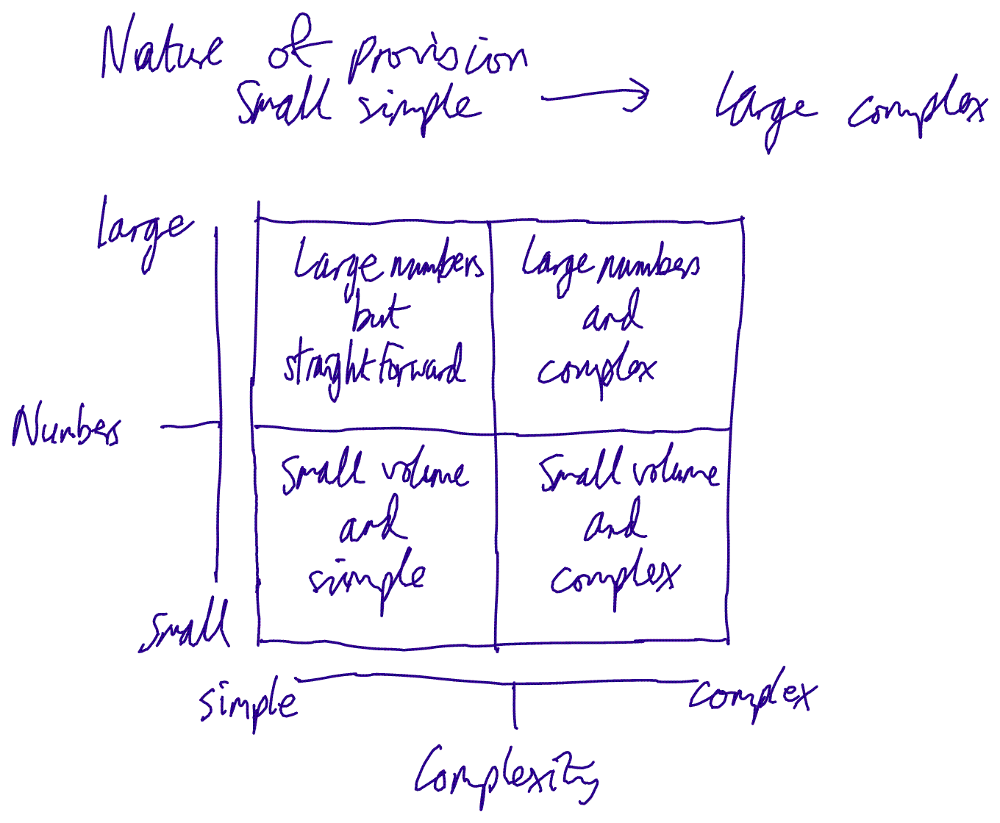

XIM Blog 
========

### From Xcri 

Jump to: [navigation](XIM_Blog.html#column-one),
[search](XIM_Blog.html#searchInput)

[Back to XIM home
page.](XIM_-_XCRI_Implementation_Models.html "XIM - XCRI Implementation Models")

+--------------------------------------------------------------------------+
|                                                       |
|                                                                          |
| Contents                                                                 |
| --------                                                                 |
|                                                                          |
|                                                                    |
|                                                                          |
| -   [1 May          |
|     2008](XIM_Blog.html#May_2008)                                 |
| -   [2 April        |
|     2008](XIM_Blog.html#April_2008)                               |
| -   [3 March        |
|     2008](XIM_Blog.html#March_2008)                               |
| -   [4 February     |
|     2008](XIM_Blog.html#February_2008)                            |
| -   [5 January      |
|     2008](XIM_Blog.html#January_2008)                             |
+--------------------------------------------------------------------------+

\[[edit](../index.php@title=XIM_Blog&action=edit&section=1.html "Edit section: May 2008")\]  May 2008 
------------------------------------------------------------------------------------------------------------------------------------------------------------------------

Final report for the XIM project is now with JISC. Find it
[here](http://www.alanpaull.co.uk/xim/docs/XIMreport2008-06-20.pdf "http://www.alanpaull.co.uk/xim/docs/XIMreport2008-06-20.pdf"){.external
.text}.

\[[edit](../index.php@title=XIM_Blog&action=edit&section=2.html "Edit section: April 2008")\]  April 2008 
----------------------------------------------------------------------------------------------------------------------------------------------------------------------------

XIM reporting was included in the XCRI
[presentation](http://www.alanpaull.co.uk/xim/docs/XIM-2008-04-15.ppt "http://www.alanpaull.co.uk/xim/docs/XIM-2008-04-15.ppt"){.external
.text} at the JISC Conference 15 April 2008.

I circulated draft implementation models (UML activity diagrams) and
textual descriptions of scenarios to reviewers. I received several very
valuable comments from the team, which led me to tweak a couple of the
models; specifically I have added a variant of the Integrated Content
Management System model, so that it covers a case in which an integrated
MIS system is also used, linked by common course identifiers to the CMS.

\[[edit](../index.php@title=XIM_Blog&action=edit&section=3.html "Edit section: March 2008")\]  March 2008 
----------------------------------------------------------------------------------------------------------------------------------------------------------------------------

Have now had very positive feedback to the HEI readiness template from
nearly all the validators. As a result of feedback, I have revised the
visualisation of the characteristic scales to this:

[{width="483"
height="323"}](Image%253ASpiderCharacteristic.gif.html "Spider diagram showing HEI XCRI readiness characteristics")

[Final XIM template for HEI XCRI readiness
characteristics](http://www.alanpaull.co.uk/xim/docs/XIM.dot "http://www.alanpaull.co.uk/xim/docs/XIM.dot"){.external
.text}

\[[edit](../index.php@title=XIM_Blog&action=edit&section=4.html "Edit section: February 2008")\]  February 2008 
----------------------------------------------------------------------------------------------------------------------------------------------------------------------------------

Drafted the first cut of the HEI readiness template. The characteristic
scales look like this:

[{width="1272"
height="681"}](Image%253AExampleCharacteristics.gif.html "Draft characteristic scales")

Had very useful meetings with Graduate Prospects, Tameside College and
the University of Manchester. The last two were project initiations for
the [GMSA](http://www.gmsa.ac.uk/ "http://www.gmsa.ac.uk/"){.external
.text} XCRI mini-project, but this work is likely to impact on XIM too.
Working with Graduate Prospects and the University of Manchester may
enable XIM to extend its data collecting organisation models and to
capture almost all the courses data from a single HEI.

\[[edit](../index.php@title=XIM_Blog&action=edit&section=5.html "Edit section: January 2008")\]  January 2008 
--------------------------------------------------------------------------------------------------------------------------------------------------------------------------------

Continued reviewing 2007 mini-projects via talking to participants and
looking at documentation, including the (relatively sparse) JISC
reports.

Found a small number of practitioners to validate the outputs of the
project, in particular the XCRI readiness template and the scenarios
that will act as business models.

Did some initial work on relevant attributes of HEIs in relation to
readiness to implement XCRI, for example:

[{width="1360"
height="1120"}](Image%253ANature_of_provision-1.1.gif.html "alt text")

We have arranged to do a briefing at UCAS Admissions Conference on XCRI.

Visited Phosphorix at the end of the month. Went through the process of
installing Selwyn's IONetwork software for courses. This includes an
ionetworknode, course hub, course agent and optionally a portal. It all
runs on Apache Tomcat and provides services for importing data, editing
(fairly crude), and publishing. It's main strengths seem to be that it
permits a range of deployments - for example, at an HEI, at an agency or
at a data collecting organisation. It would save an HEI from having to
mount its own web services for publishing data. It also permits sharing
across nodes for searching and data exchange. Portals can pull the data
by subscribing to hubs; publishing can push from agent to hub. All this
means that there seem to be a range of possible implementation models.

Retrieved from
"[http://localhost/XIM\_Blog](XIM_Blog.html)"

##### Views

-   

    

    [Article](XIM_Blog.html)
-   

    

    [Discussion](../index.php@title=Talk%253AXIM_Blog&action=edit.html)
-   

    

    [Edit](../index.php@title=XIM_Blog&action=edit.html)
-   

    

    [History](../index.php@title=XIM_Blog&action=history.html)

##### Personal tools

-   

    

    [127.0.0.1](User%253A127.0.0.1.html)
-   

    

    [Talk for this IP](User_talk%253A127.0.0.1.html)
-   

    

    [Log in / create
    account](../index.php@title=Special%253AUserlogin&returnto=XIM_Blog.html)

##### Navigation

-   

    

    [XCRI Wiki](../../wiki.1.html)
-   

    

    [XCRI website](http://www.xcri.org/)
-   

    

    [Current events](Current_events.html)
-   

    

    [Recent changes](Special%253ARecentchanges.html)
-   

    

    [Help](Help%253AContents.html)

##### Search

 

##### Toolbox

-   

    

    [What links here](Special%253AWhatlinkshere/XIM_Blog.html)
-   

    

    [Related changes](Special%253ARecentchangeslinked/XIM_Blog.html)
-   

    

    [Upload file](Special%253AUpload.html)
-   

    

    [Special pages](Special%253ASpecialpages.html)
-   

    

    [Printable version](../index.php@title=XIM_Blog&printable=yes.html)
-   

    

    [Permanent link](../index.php@title=XIM_Blog&oldid=947.html)

-   

    

    This page was last modified 01:12, 18 June 2008.
-   

    

    This page has been accessed 6,509 times.
-   

    

    Content is available under [Attribution
    3.0](http://creativecommons.org/licenses/by/3.0/ "http://creativecommons.org/licenses/by/3.0/").
-   

    

    [Privacy policy](Xcri%253APrivacy_policy.html "Xcri:Privacy policy")
-   

    

    [About Xcri](Xcri%253AAbout.html "Xcri:About")
-   

    

    [Disclaimers](Xcri%253AGeneral_disclaimer.html "Xcri:General disclaimer")

